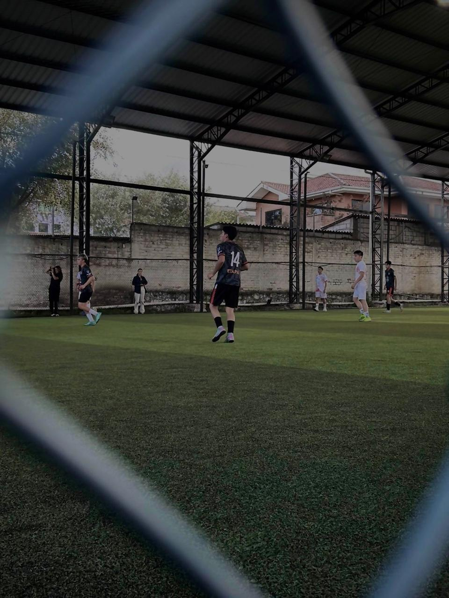

#Programacion y plataformas Wber
#Práctica 1 – Explorando los Estándares Web con HTML, CSS y JavaScript**

**Asignatura:** Programación y Plataformas Web  
**Unidad:** 1.2 – Estándares Web  
**Estudiante:** Sebastian Cabrera
**Repositorio:**  
**Página desplegada (GitHub Pages):** https://ccabreram1.github.io/icc-ppw-u1-mi_pagina_web/

---

## Estructura HTML utilizada

| Componente | Descripción | Implementación |
|-------------|--------------|----------------|
| `<!DOCTYPE html>` | Declaración del documento HTML5 | Línea 1 |
| `<html lang="es">` | Idioma del documento | Español |
| `<header>` | Encabezado principal | Contiene `<h1>` y `<h2>` |
| `<section>` | Agrupa contenido principal | Dos secciones con `<h2>` |
| `<table>` | Muestra los elementos estudiados | Tres filas con `<th>` y `<td>` |
| `<footer>` | Pie de página | Nombre del estudiante y asignatura |


## Nuevas etiquetas exploradas

| Etiqueta | Descripción | Implementación |
|-----------|--------------|----------------|
| `<figure>` | Contenedor para imagen con pie de foto | Futbol y paseo `<figcaption>` |
| `<aside>` | Contiene link de publicidad | Representa instagram del autor |

**Código usado:**
```html
<figure id="imagenes">
  <div>
     
    <figcaption>Futbol</figcaption>
  </div>
  <div>
    
    <figcaption>Paseo</figcaption>
  </div>
</figure>

<aside>
  <h2>REDES SOCIALES</h2>
  <ul>
    <li><a href="https://www.instagram.com/tato_cabrera_jr?igsh=ZDA2NHp4M291YTds&utm_source=qr">INSTAGRAM</a></li>
  </ul>
</aside>

#  Práctica 2 – Adición de CSS y JavaScript
---

| Archivo     | Descripción                                                                                         | Ubicación                 |
| ----------- | --------------------------------------------------------------------------------------------------- | ------------------------- |
| `style.css` | Contiene todos los estilos visuales del sitio (colores, tipografía, márgenes, botones, tabla, etc.) | Carpeta raíz del proyecto |
| `script.js` | Contiene las funciones y eventos JavaScript que agregan comportamiento dinámico                     | Carpeta raíz del proyecto |

Estructura final del proyecto:

```
icc-ppw-u1-mi_pagina_web/
│
├── Futbol.png.jpg
├── index.html
├── Novia.png.jpg
├── script.js 
├── style.css
└── README.md
```

### 2. Implementación en HTML

Los nuevos archivos se enlazaron dentro del documento `index.html` de la siguiente forma:

**En el `<head>` (para el CSS):**

```html
   <link rel="stylesheet" href="style.css">
```

**Antes de cerrar el `<body>` (para el JavaScript):**

```html
    <script src="scripts.js"></script>
```


